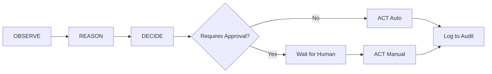

# 🛡️ Aegis - AI Support Agent

An **Agentic AI system** for automating support ticket triage during e-commerce platform migrations. The agent follows a complete **OBSERVE → REASON → DECIDE → ACT** loop with human-in-the-loop approval for high-risk actions.

## 🎯 Problem Statement

During platform migrations (e.g., hosted-to-headless), customer support is overwhelmed by a surge of tickets related to:
- Broken checkouts & webhook timeouts
- Image/CDN 404 errors  
- API authentication failures
- Shipping calculation issues
- Cart persistence problems
- Payment gateway errors

This agent observes patterns, reasons about root causes using an LLM, and takes (or recommends) actions with clear risk assessment.

---

## ✨ Features

- **Pattern Detection**: Identifies systemic issues affecting multiple merchants
- **LLM-Powered Root Cause Analysis**: Uses Groq + Llama 3.3 70B for fast inference
- **Risk-Based Decision Making**: Low-risk actions auto-execute; high-risk require approval
- **Human-in-the-Loop (HITL)**: Approval workflow for critical actions
- **Full Explainability**: Every decision includes reasoning, confidence scores
- **Audit Logging**: Persistent log of all actions for compliance
- **Modern React Dashboard**: Real-time monitoring with purple/navy glassmorphic UI

---

## 🛠️ Tech Stack

### Frontend
| Technology | Purpose |
|------------|---------|
| React 18 | UI Components |
| Vite | Build tool & Dev Server |
| TanStack Query | Data fetching & caching |
| Tailwind CSS 4 | Styling |
| Lucide React | Icons |
| Axios | HTTP client |

### Backend
| Technology | Purpose |
|------------|---------|
| Python 3.10+ | Runtime |
| Flask | REST API |
| Flask-CORS | Cross-origin requests |

### AI/LLM
| Technology | Purpose |
|------------|---------|
| Groq API | LLM inference (ultra-fast) |
| Llama 3.3 70B | Language model |

---

## 🚀 Getting Started

### Prerequisites
- Python 3.10+
- Node.js 18+
- Groq API Key

### Installation

```bash
# Clone the repository
git clone <your-repo-url>
cd healing-agent

# Install Python dependencies
python -m venv venv
.\venv\Scripts\activate  # Windows
pip install -r requirements.txt

# Install frontend dependencies
cd frontend
npm install
```

### Configuration

Create a `.env` file in the root directory:

```
GROQ_API_KEY=your_groq_api_key_here
```

### Running the Application

**Option 1: Quick Start (Windows)**
```bash
# Double-click start.bat or run:
start.bat
```

**Option 2: Manual Start**
```bash
# Terminal 1 - Backend
cd backend
python app.py

# Terminal 2 - Frontend  
cd frontend
npm run dev
```

Access the dashboard at `http://localhost:5173`

---

## 📚 Project Structure

```
healing-agent/
├── frontend/               # React + Vite app
│   ├── src/
│   │   ├── components/     # React components
│   │   │   ├── Layout.jsx
│   │   │   ├── StatsCard.jsx
│   │   │   ├── TicketList.jsx
│   │   │   ├── AgentActionPanel.jsx
│   │   │   ├── AuditLogTable.jsx
│   │   │   └── SettingsPage.jsx
│   │   ├── services/api.js # API calls
│   │   └── App.jsx         # Main app
│   └── package.json
├── backend/
│   ├── app.py              # Flask API endpoints
│   └── datagenerator.py    # Ticket generator
├── agent.py                # Core AI agent logic
├── data/
│   ├── tickets.json        # Support tickets
│   ├── decisions.json      # Pending decisions
│   └── audit_log.json      # Action history
├── requirements.txt
├── start.bat               # Quick start script
└── README.md
```

---

## 🔁 Agent Loop



---

## 🖥️ Dashboard Features

- **Stats Overview**: Active tickets, critical/high severity, executed actions, pending approvals
- **Ticket List**: Real-time ticket feed with severity badges
- **Agent Analysis Panel**: Root cause analysis, confidence scores, recommended actions
- **Audit Log**: Complete history of all agent actions
- **Settings**: Configure LLM model, ticket generation, HITL thresholds

---

## 📡 API Endpoints

| Method | Endpoint | Description |
|--------|----------|-------------|
| GET | `/api/health` | Health check |
| GET | `/api/tickets` | Get all tickets |
| POST | `/api/process-all` | Run agent on all tickets |
| POST | `/api/approve` | Approve pending action |
| POST | `/api/reject` | Reject pending action |
| GET | `/api/audit-log` | Get audit history |
| POST | `/api/clear-audit-log` | Clear audit log |
| POST | `/api/generate-tickets` | Generate new tickets |
