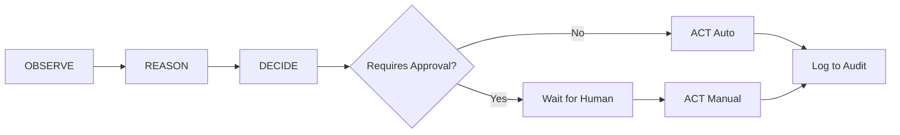

# 🤖 Self-Healing Support Agent

An **Agentic AI system** for automating support ticket triage during e-commerce platform migrations (e.g., hosted-to-headless). The agent follows a complete **OBSERVE → REASON → DECIDE → ACT** loop.

## 🎯 Problem Statement

During platform migrations, customer support is overwhelmed by a surge of tickets related to:
-   Broken checkouts
-   Misconfigured webhooks
-   Frontend/backend mismatches
-   Unclear documentation

This agent observes patterns, reasons about root causes using an LLM (Gemini), and takes (or recommends) actions with clear risk assessment and human-in-the-loop approval for high-risk decisions.

---

## ✨ Features

-   **Pattern Detection**: Identifies systemic issues affecting multiple merchants.
-   **LLM-Powered Root Cause Analysis**: Uses Google Gemini to diagnose issues.
-   **Risk-Based Decision Making**: Low-risk actions are auto-executed; high-risk ones require human approval.
-   **Human-in-the-Loop (HITL)**: Approval workflow for critical actions.
-   **Full Explainability**: Every decision includes reasoning, confidence scores, and assumptions.
-   **Audit Logging**: Persistent log of all actions for compliance and review.

---

## 🛠️ Tech Stack

| Component       | Technology                       |
| :-------------- | :------------------------------- |
| **AI Model**    | Google Gemini Pro                |
| **Backend API** | Python, Flask                    |
| **Frontend (Temp)** | Streamlit                    |
| **Frontend (Planned)** | React.js                  |

---

## 🚀 Getting Started

### Prerequisites

-   Python 3.10+
-   A Google AI API Key (Gemini)

### Installation

```bash
# Clone the repository
git clone <your-repo-url>
cd healing-agent

# Create a virtual environment
python -m venv venv
.\venv\Scripts\activate  # On Windows
# source venv/bin/activate  # On macOS/Linux

# Install dependencies
pip install -r requirements.txt
```

### Configuration

Create a `.env` file in the `healing-agent` directory:

```
GEMINI_API_KEY=your_api_key_here
```

### Running the Application

**Option 1: Run the Backend API (for React integration)**
```bash
cd backend
python app.py
```
The API will be available at `http://localhost:5000`. See [API_DOCS.md](API_DOCS.md) for endpoints.

**Option 2: Run the Temporary Streamlit Dashboard**
```bash
streamlit run dashboard.py
```

---

## 📚 Project Structure

```
healing-agent/
├── agent.py            # Core Agent Logic (OBSERVE, REASON, DECIDE, ACT)
├── dashboard.py        # Temporary Streamlit UI
├── requirements.txt
├── .env
├── data/
│   ├── tickets.json    # Generated support tickets
│   └── audit_log.json  # Persistent action log
└── backend/
    ├── app.py          # Flask API Server
    └── datagenerator.py # Synthetic ticket generator
```

---

## 🔁 Agent Loop



---

## 📄 License

MIT
